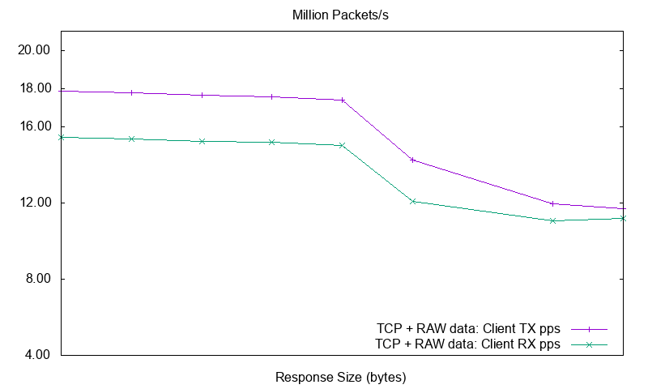
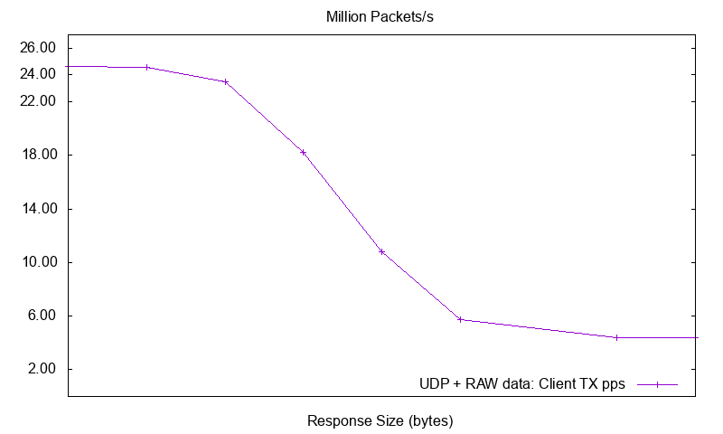

<div align="center">
  
</div>

<p>
<div align="center">
  
</div>
</p>

_WARP17, The Stateful Traffic Generator for L1-L7_ is a lightweight solution
for generating high volumes of session based traffic with very high setup
rates. WARP17 currently focuses on L5-L7 application traffic (e.g., _HTTP_)
running on top of TCP as this kind of traffic requires a complete TCP
implementation.
Nevertheless, WARP17 also supports application traffic running on top of UDP.

Developing network components or services usually requires expensive
proprietary solutions for validating the implemented functionalities and
scalability or performance requirements.
WARP17 is a platform agnostic tool based on [DPDK](http://dpdk.org/) which:

* allows extremely fast generation and sustaining of stateful sessions
* offers configurable TCP/UDP infrastructure which can be used for generating
  high connection setup and data rates for application traffic
* is [Linux](https://kernel.org/) based so all the openly available tools can
  be integrated by the users of WARP17.

The WARP17 TCP/IP implementation runs completely in user-space thus avoiding
the additional latency in the kernel stack. From a hardware perspective,
WARP17 will be able to run on all the platforms that are supported by DPDK.

# Performance benchmarks

You can find all the performance tests descriptions and the reference
hardware architecture details in the [doc folder](./doc/Performance.md).

## TCP setup and data rates for RAW application traffic

__NOTE__: In the case when we only want to test the TCP control implementation
(i.e., the TCP 3-way handshake and TCP CLOSE sequence), WARP17 achieved the
maximum setup rate of 8.5M clients/s and 8.5M servers/s, __so a total of
17M TCP sessions are handled every second__.

The tests set up 20 million TCP sessions (i.e., 10 million TCP clients and 10
million TCP servers) on which clients continuously send fixed size requests
(with random payload) and wait for fixed size responses from the servers.

* TCP raw traffic link utilization reaches line rate (40Gbps) as we increase
  the size of the requests and responses. When line rate is achieved the number
  of packets that actually make it on the wire decreases (due to the link
  bandwidth):

<div align="center">
  
  
</div>

* TCP raw traffic setup rate is stable at approximately
  __7M sessions per second__ (3.5M TCP clients and 3.5M TCP servers per second)

<div align="center">
  
</div>

## TCP setup and data rates for HTTP application traffic

The tests set up 20 million TCP sessions (i.e., 10 million TCP clients and 10
million TCP servers) on which the clients continuously send _HTTP GET_
requests and wait for the _HTTP_ responses from the servers.

* HTTP traffic link utilization reaches line rate (40Gbps) as we increase the
  size of the requests and responses. When line rate is achieved the number
  of packets that actually make it on the wire decreases (due to the link
  bandwidth):

<div align="center">
  
  
</div>

* HTTP traffic setup rate is stable at approximately
  __7M sessions per second__ (3.5M HTTP clients and 3.5M HTTP servers per
  second)

<div align="center">
  
</div>

## UDP setup and data rates for RAW application traffic

The tests continuously send UDP fixed size packets (with random
payload) from 10 million clients which are processed on the receing side by
10 million UDP listeners.

* UDP packets are generated at approximately __22 Mpps__ (for small packets) and
  as we reach the link bandwidth the rate decreases.

<div align="center">
  
  
</div>

# Installing and configuring

## Prerequisites

Any 64 bit Linux distribution will do, however we have been testing this with
Ubuntu Server 18.04 LTS. In addition we have made an OVF virtual machine image
available, details can be found in the respective [documentation](ovf/README.md).

### Install DPDK

Run the automated script with `<version>` as 19.11.3 (the latest LTS supported by warp17)

```
# ./build_dpdk.sh -v <version>
```

### Install Google Protocol Buffers

Run `dep_install.sh` as root from the source folder

```
# ./dep_install.sh
```

## Get WARP17
Get the `warp17-<ver>.tgz` archive or clone the desired
[release](https://github.com/Juniper/warp17/releases).

## Compile WARP17

```
tar xfz warp17-<ver>.tgz
cd warp17-<ver>
make
```

## Configure Python virtualenv (on Ubuntu)

```
sudo apt-get install python3-pip
sudo pip install virtualenv
virtualenv warp17-venv
source warp17-venv/bin/activate
pip install -r python/requirements.txt
```

Once installed, whenever python tests need to run the virtual environment must
be activated:

```
source warp17-venv/bin/activate
```

To exit the virtual environment and return to the default python interpretor
and libraries:

```
deactivate
```

## Configure DPDK ports

Use the `$RTE_SDK/usertools/dpdk-setup.sh` script (as described in the
[DPDK Guide](http://dpdk.org/doc/guides/linux_gsg/quick_start.html)). Select
which ports to be controlled by the IGB UIO module: option `Bind
Ethernet/Crypto device to IGB UIO module`.

# How to run

From the top directory of WARP17:

```
./build/warp17 <dpdk-command-line-args> -- <warp17-command-line-args>
```

## Running as non-root

After compiling WARP17 change the owner of the binary to `root` (in order to
allow access to `/proc/self/pagemap`:):

```
sudo chown root build/warp17
```

Set the `suid` bit on the binary in order to allow the user to keep
permissions:

```
sudo chmod u+s build/warp17
```

## Command-line arguments

### DPDK command-line arguments

* `-c <hex_mask>`: bitmask specifying which physical cores the application
  will use. Each bit corresponds to a physical core (0-`<max_cores>`).
* `-n <chan_no>` : number of memory channels to be used.
* `-m <mem_in_MB>`: total memory available to the application (in MB).

Please check section 3.1 of the
[DPDK App Guide](http://dpdk.org/doc/guides/testpmd_app_ug/run_app.html) for
more info about DPDK command-line arguments.

__NOTE: For now WARP17 supports at most 64 cores.__

### WARP17 command-line arguments

* `--version`: prints version and exit.
* `--help`: prints the help and exit.
* `--qmap <port>.<hex_mask>`: bitmask specifying which physical cores will
  control the physical port <eth_port>.
* `--qmap-default max-c`: maximize the number of independent cores handling
  each physical port.
* `--qmap-default max-q`: maximize the number of transmit queues per physical
  port.
* `--tcb-pool-sz`: configure the size of the TCP control block pool (one TCB is
  used per TCP connection endpoint). The size of the pool will be given by the
  argument of this option multiplied by 1024. By default 10M TCBs are
  allocated.
* `--ucb-pool-sz`: configure the size of the UDP control block pool (one UCB is
  used per UDP connection endpoint). The size of the pool will be given by the
  argument of this option multiplied by 1024. By default 10M UCBs are
  allocated.
* `--mbuf-pool-sz`: configure the size of the packet pool. The size of the
  pool will be given by the argument of this option multiplied by 1024. By
  default 768K packets are allocated.
* `--mbuf-sz`: configure the size of a packet fragment (mbuf) in bytes. By
  default fragments are 2048 bytes.
* `--mbuf-hdr-pool-sz`: configure the size of the packet headers pool. The
  size of the pool will be given by the argument of this option multiplied by
  1024. By default 512K packet headers are allocated.
* `--mpool-any-sock`: configure if memory pools should be created from
  any available memory if the local socket memory is exhausted. By default
  this feature is disabled as it might affect performance.
* `--ring-if-pairs`: configure the number of _in-memory-ring-based_ interfaces.
  __NOTE: please check section
  [Using In-Memory-Ring-Based Interfaces](#using-in-memory-ring-based-interfaces)
  for more information.__
* `--kni-ifs`: configure the number of _kni_ interfaces.
  __NOTE: please check section
  [Using Kernel Network Interface (KNI) Interfaces](#using-kernel-network-interface-kni-interfaces) for more information.__

* `--cmd-file=<file>`: CLI command file to be executed when the application
  starts

__NOTE: Options qmap, qmap-default max-c/max-q, cannot be combined. Only one can
be passed at a given time.__

__NOTE: Users are encouraged to use the "qmap-default max-q" option whenever
ethernet ports are on the same socket as the PKT cores as this usually gives
the best performance!__

__NOTE: The lowest two cores will be dedicated to CLI and management processing,
and can not be assigned to a physical port for packet processing using the
`--qmap` option!__

### Example (on a x86 server with 32G RAM for WARP17 and 4 memory channels):

* Determine the number of physical cores:

	```
	$ lscpu | grep "CPU(s)"
	CPU(s):                12
	```

	Decide how many cores WARP17 should use. In this example we consider WARP17
    uses 8 cores:
	- cores 6, 7, 8, 9, 10, 11 for packet processing
	- cores 0, 1 for CLI and management

	Based on that we determine the bitmask corresponding to the ids of the cores
    we would like to use. The bit index in the bit mask corresponds to the core
    id:

	```
	Bitmask:  0  0  0  0      1   1  1  1     1  1  0  0     0  0  1  1 => 0xFC3
	Bit idx: 15 14 13 12     11  10  9  8     7  6  5  4     3  2  1  0
	```

	This corresponds to the `-c` command line argument.

* Determine the number of memory channels:

	```
	$ dmidecode | grep Channel
	    Bank Locator: P0_Node0_Channel0_Dimm0
	    Bank Locator: P0_Node0_Channel1_Dimm0
	    Bank Locator: P0_Node0_Channel2_Dimm0
	    Bank Locator: P0_Node0_Channel3_Dimm0  <<<< the system has 4 channels (0-3)
	```

	The `-n` command line argument should be usually set to the max number of
	channels available in the system.

    WARP17 should be using 32G of memory in this example so the `-m` command
    line argument should be set to 32768.

	In order for WARP17 to use the default core to port mapping while
	maximizing the number of transmit queues the `--qmap-default` command line
	argument should be set to `max-q`.

* _Optional_: the startup commands file can be specified through the `--cmd-file`
command line argument.

For our example this translates into the following command:

```
./build/warp17 -c FC3 -n 4  -m 32768 -- --qmap-default max-q --tcb-pool-sz 32768 --cmd-file cfg.txt
```

which will start WARP17 with:

* 8 cores to be used by the application (`-c FC3`):
    - 2 cores will be used by CLI and MGMT
    - 6 cores for processing packets
* 4 mem channels (`-n 4`)
* 32G of available memory (`-m 32768`)
* all 6 PKT cores will process all physical ports (`--qmap-default max-q`)
* allocates 32 million TCBs (`--tcb-pool-sz 32768`): for the configs in the
  examples sections we need 20M TCBs, i.e., 10M clients and 10M servers.
* will execute the CLI commands in file cfg.txt after starting WARP17

### Using In-Memory-Ring-Based Interfaces

WARP17 can also be run when no physical interface is available. This is
especially useful when developing new features as it removes the requirement
of a specific hardware configuration. It also allows users to quickly try out
WARP17 on their own laptop/VM.

_In-Memory-Ring-Based Interfaces_ (let's just call them _ring interfaces_)
are always created in pairs. The two interfaces in a pair act as if they
would be physical interfaces connected back to back.

By default the support for ring interfaces is disabled. However the user can
easily enable it by compiling WARP17 with the following command:

```
make all-ring-if
```

Using the `--ring-if-pairs <number>` command line argument the user can
specify the number of ring interface pairs that WARP17 will create. Updating
the previous command line example we end up with:

```
./build/warp17 -c FC3 -n 4  -m 32768 -- --qmap-default max-q --tcb-pool-sz 32768 --ring-if-pairs 1 --cmd-file cfg.txt
```

This will start WARP17 and add a pair of ring interfaces connected back to
back.

The user can also use custom queue mappings for ring interfaces. The ring
interface pairs are always created after physical interfaces. This means that
their IDs will be allocated in order after physical IDs. For example:

```
./build/warp17 -c FC3 -n 4  -m 32768 -w 0000:82:00.0 -- --ring-if-pairs 1
```

This will start WARP17 with three interfaces (one physical and two ring
interfaces). The physical interface (`0000:82:00.0`) will have ID 0 while
the two ring interfaces will have IDs 1 and 2.

__NOTE: There's a restriction in place when using ring interfaces: the user
must make sure that the same number of TX/RX queues is created through qmaps
for both ring interfaces in a pair. Otherwise the command line will be
rejected.__

### Using Kernel Network Interface (KNI) Interfaces

WARP17 can also be run with a virtual interface into the Linux kernel. This
is especially useful when developing a new protocol and you want to test it
agains a known working server or client. See the HTTP example below.

By default the support for KNI interfaces is disabled. However the user can
easily enable it by compiling WARP17 with the following command:

```
make all-kni-if
```

Using the `--kni-ifs <number>` command line argument the user can specify
the number of KNI interfaces that WARP17 will create. Updating
the previous command line example we end up with:

```
./build/warp17 -c FC3 -n 4  -m 32768 -- --qmap-default max-q --tcb-pool-sz 32768 --kni-ifs 2 --cmd-file cfg.txt
```

The user can also use custom queue mappings for KNI interfaces, however they
can only be assigned to a single core. The KNI interfaces are always created
after the physical and ring interfaces. This means that
their IDs will be allocated in order after physical IDs. For example:

```
./build/warp17 -c FC3 -n 4  -m 32768 -w 0000:82:00.0 -- --ring-if-pairs 1 --kni-ifs 2
```

This will start WARP17 with five interfaces (one physical, two ring
interfaces and two KNI interfaces). The physical interface (`0000:82:00.0`)
will have ID 0, the two ring interfaces will have IDs 1 and 2, and the two
KNI interfaces will have IDs 3 and 4.

For the example above the two Kernel interfaces will be named `warp3` and `warp4`,
so the naming convention is `warp<eth_port>`

The following example will show how to use the KNI interface to get some HTTP
data from the built in HTTP server trough Linux. We assume no physical ports
are configured, if you have them make sure you increase all the referenced
ports:

* Load the `rte_kni` DPDK module (if needed), either as shown below or by
  running the `$RTE_SDK/usertools/dpdk-setup.sh` script and selecting option
  `Insert KNI module`:

```
sudo modprobe rte_kni
```

* Start WARP17 while blacklisting all physical devices (just for the purpose of
  this test as otherwise the KNI interface name might differ):

```
./build/warp17 -c FC3 -n 4  -m 32768 -w 0000:00:00.0 -- --kni-ifs 1
```

* Configure the Linux kernel interface:

```
sudo ip link set warp0 up
sudo ip addr add 172.16.1.1/24 dev warp0
```

* Configure WARP17 as follows:

```
add tests l3_intf port 0 ip 172.16.1.2 mask 255.255.255.0
add tests l3_gw port 0 gw 172.16.1.1
add tests server tcp port 0 test-case-id 0 src 172.16.1.2 172.16.1.2 sport 80 80
set tests server http port 0 test-case-id 0 200-OK resp-size 2000
start tests port 0
```

* Now do a HTTP request using wget:

```
[WARP17:~]$ wget 172.16.1.2
--2016-10-25 11:40:43--  http://172.16.1.2/
Connecting to 172.16.1.2:80... connected.
HTTP request sent, awaiting response... 200 OK
Length: 2000 (2.0K)
Saving to: ‘index.html’

index.html                         100%[================================================================>]   1.95K  --.-KB/s   in 0s

2016-10-25 11:40:43 (478 MB/s) - ‘index.html’ saved [2000/2000]
```


# CLI

## Test configuration commands

__NOTE: Only IPv4 is supported for now!__

* __Configure Ethernet Port MTU__:

	```
	set tests mtu port <eth_port> <mtu-value>
	```

* __Add L3 interfaces__: configure an IP interface with the specified `ip`
  address and `mask`. Currently only 10 IP interfaces are supported per port.

	```
	add tests l3_intf port <eth_port> ip <ip> mask <mask>
	```

* __Add L3 default gateway__: configure 'gw' as the default gateway for
  `eth_port`. There is only one default GW per port.

	```
	add tests l3_gw port <eth_port> gw <gw_ip>
	```

* __Add L3 interfaces with specific VLAN and GW__: Configure interfaces (Upto 10)
  with a specified `ip` address/mask, `vlan-id` and `gw`. Each interface can be
  in a different subnet and an unique vlan-id and gateway can be configured for
  each.

	```
	add tests l3_intf port <eth_port> ip <ip> mask <mask> vlan-id <vlan-id> gw <gw>
	```

  - The Grat Arp Req/Reply for the interfaces will be sent using the vlan-id configured.
  - ARP request will be sent to the GW using the configured vlan-id.
  - ARP reply packets will use the vlan-id from the ARP req packet.
  - A per port per vlan-id GW table is maintained. The traffic streams will use this table
    for next-hop GW lookup based on its vlan-id configurations (vlan-options per test-case-id).
    A quick lookup is done on the per port per vlan id GW table; if no match is found then
    the default GW configured for the port will be used.
  - Currently only 10 IP interfaces are supported per port.

* __Configure server test cases__: configure a server test case with ID
  `test-case-id` on `eth_port`. The underlying L4 traffic can be TCP or UDP.
  `ip_range` and `port_range` define the `<ip:port>` sockets on which the
  servers will be listening. By default, the application (L5-L7) traffic will
  be RAW traffic.

	```
	add tests server tcp|udp port <eth_port> test-case-id <tcid>
	                 src <ip_range> sport <port_range>
	```

* __Configure client test cases (per port)__: configure a client test case with
  ID `test-case-id` on `eth_port`. The underlying L4 traffic can be TCP or UDP.
  The source IP/l4-port and destination IP/l4-port ranges define the
  `<src_ip, src_port:dst_ip, dst_port>` TCP/UDP connections that will be
  established. By default, the application (L5-L7) traffic will be RAW traffic.

	```
	add tests client tcp|udp port <eth_port> test-case-id <tcid>
	                 src <ip-range> sport <l4-ports>
	                 dest <ip-range> dport <l4-ports>
	```

* __Configure multicast source test cases (per port)__: configure a multicast
  source test case with ID `test-case-id` on `eth_port`. The underlying L4
  traffic can only be UDP. The source IP/l4-port and destination IP/l4-port
  ranges define the `<src_ip, src_port:dst_ip, dst_port>` UDP multicast streams
  that will be generated. By default, the application (L5-L7) traffic will be
  RAW traffic. Destination IP ranges must be valid IP Multicast ranges.

	```
	add tests multicast-src udp port <eth_port> test-case-id <tcid>
	                        src <ip-range> sport <l4-ports>
	                        dest <ip-mcast-range> dport <l4-ports>
	```

* __Configure test profile timeouts__: each test has a specific timeout profile
  which is defined by the initial delay after which client connections are
  initiated, how long a connection should live and how long a connection should
  stay down (after closing) before the client reconnects.

    - __initial_delay__: amount of time (in seconds) the clients defined in the
      test should wait before initiating a connection. `infinite` is allowed but
      doesn't really make sense for the initial delay as it would cause the
      clients to never initiate a connection.

		```
		set tests timeouts port <eth_port> test-case-id <tcid> init <timeout>|infinite
		```
    - __conn_uptime__: amount of time (in seconds) the clients defined in the
      test should keep the connection up (and send application traffic) before
      initiating a close. `infinite` allows the clients to stay up forever.

		```
		set tests timeouts port <eth_port> test-case-id <tcid> uptime <timeout>|infinite
		```
    - __conn_downtime__: amount of time (in seconds) the clients defined in the
      test should keep the connection down after a closebefore initiating a
      reconnect. `infinite` allows the clients to stay down forever.

		```
		set tests timeouts port <eth_port> test-case-id <tcid> downtime <timeout>|infinite
		```

* __Configure test profile rates__: each test has a specific rate limiting
  profile which is defined by the connection open, close and send rate.

    - __setup rate__: number of connections that the clients in the test are
      allowed to initiate __per second__. `infinite` removes any rate limiting
      for initiating sessions (i.e., WARP17 will try to do it as fast as possible).

		```
		set tests rate port <eth_port> test-case-id <tcid> open <rate>|infinite
		```
    - __close rate__: number of connections that the clients in the test are
      allowed to close __per second__. `infinite` removes any rate limiting for
      closing sessions (i.e., WARP17 will try to do it as fast as possible).

		```
		set tests rate port <eth_port> test-case-id <tcid> close <rate>|infinite
		```
    - __data rate__: number of connections that the clients in the test are
      allowed to send traffic on __per second__. `infinite` removes any rate
      limiting for sending traffic (i.e., WARP17 will try to do it as fast as
      possible).

		```
		set tests rate port <eth_port> test-case-id <tcid> send <rate>|infinite
		```

* __Configure test criteria__: different criteria can be configured for each
  test case. The criteria will be used for declaring a test as _PASSED_ or
  _FAILED_.
    - __run-time__: declare the test case with ID `tcid` as _PASSED_ after
      `value` seconds.

		```
		set tests criteria port <eth_port> test-case-id <tcid> run-time <count>
		```
    - __servers-up__: declare the test case with ID `tcid` as _PASSED_ when
      `count` servers are UP (listening for incoming connections).

		```
		set tests criteria port <eth_port> test-case-id <tcid> servers-up <count>
		```
    - __clients-up__: declare the test case with ID `tcid` as _PASSED_ when
      `count` clients are UP (ready to initiate a connection).

		```
		set tests criteria port <eth_port> test-case-id <tcid> clients-up <count>
		```
    - __clients-established__: declare the test case with ID `tcid` as _PASSED_
      when `count` clients have established a connection.

		```
		set tests criteria port <eth_port> test-case-id <tcid> clients-estab <count>
		```
    - __data-MB__: declare the test case with ID `tcid` as _PASSED_ when
      `count` MB of data have been sent. __NOTE: NOT supported yet!__

		```
		set tests criteria port <eth_port> test-case-id <tcid> data-MB <count>
		```

* __Configure tests as _asynchronous_:__ if multiple test cases are defined on
  the same `eth_port`, by default, they will be executed in sequence (when a
  test case ends the next one is started). To change the behaviour the user can
  mark a test case as _async_ forcing the test engine to advance to the next
  configured test case without waiting for the current one to finish.

	```
	set tests async port <eth_port> test-case-id <tcid>
	```

* __Delete test cases__: delete a configured test case with ID `tcid` from port
  `eth_port`.

	__NOTE: if a test case is already running it has to be stopped
	before it can be deleted!__

	```
	del tests port <eth_port> test-case-id <tcid>
	```

* __Start tests__: start all the test cases configured on `eth_port`. Test
  cases will be started in sequence (after the previous test case ended) except
  for the ones that are marked as _async_.

	```
	start tests port <eth_port>
	```

* __Stop tests__: stop all the test cases currently running on `eth_port`.

	```
	stop tests port <eth_port>
	```

* __Customize TCP stack settings__: customize the behavior of the TCP stack
  running on test case with ID `tcid` on port `eth_port`. The following
  settings are customizable:

  	- `win-size`: the size of the TCP send window.

		```
		set tests tcp-options port <eth_port> test-case-id <tcid> win-size <size>
		```

  	- `syn-retry`: number of times to retry sending `SYN` packets before
  	  aborting the connection.

		```
		set tests tcp-options port <eth_port> test-case-id <tcid> syn-retry <cnt>
		```

  	- `syn-ack-retry`: number of times to retry sending `SYN + ACK` packets
  	  before aborting the connection.

		```
		set tests tcp-options port <eth_port> test-case-id <tcid> syn-ack-retry <cnt>
		```

  	- `data-retry`: number of times to retry sending data packets before
  	  aborting the connection.

		```
		set tests tcp-options port <eth_port> test-case-id <tcid> data-retry <cnt>
		```

  	- `retry`: number of times to retry sending other control packets before
  	  aborting the connection.

		```
		set tests tcp-options port <eth_port> test-case-id <tcid> retry <cnt>
		```

  	- `rto`: retransmission timeout (in ms) to be used before retransmitting
  	  a packet.

		```
		set tests tcp-options port <eth_port> test-case-id <tcid> rto <rto_ms>
		```

  	- `fin-to`: `FIN` timeout (in ms) in order to avoid staying in state
  	  `FIN-WAIT-II` forever.

		```
		set tests tcp-options port <eth_port> test-case-id <tcid> fin-to <fin_to_ms>
		```

  	- `twait-to`: `TIME-WAIT` timeout (in ms) to wait before cleaning up the
  	  connection.

		```
		set tests tcp-options port <eth_port> test-case-id <tcid> twait-to <twait_to_ms>
		```

    - `orphan-to`: `ORPHAN` timeout (in ms) in order to avoid staying in state
      `FIN-WAIT-I` forever.

		```
		set tests tcp-options port <eth_port> test-case-id <tcid> orphan-to <orphan_to_us>
		```

    - `twait_skip`: boolean to decide if state `TIME-WAIT` should be skipped or
      not.

		```
		set tests tcp-options port <eth_port> test-case-id <tcid> twait-skip <1|0>
		```

    - `ack-delay`: boolean to decide if `ACK` should be delayed (according to
       [RFC1122, section 4.2.3.2](https://tools.ietf.org/html/rfc1122#section-4.2.3.2))
       or not. By default `ACK` delay will be __disabled__.

		```
		set tests tcp-options port <eth_port> test-case-id <tcid> ack-delay <1|0>
		```

* __Customize IPv4 stack settings__: customize the behavior of the IPv4 layer
  running on test case with ID `tcid` on port `eth_port`. The following
	settings are customizable:

  	- `tos`: the TOS field of the IPv4 header

		```
		set tests ipv4-options port <eth_port> test-case-id <tcid> tos <tos-value>
		```

  	- `dscp` and `ecn`: the DSCP/ECN field of the IPv4 header

		```
		set tests ipv4-options port <eth_port> test-case-id <tcid> dscp <dscp-name> ecn <ecn-name>
		```

  	- `tx-timestamp` and `rx-timestamp`: allow warp17 to write/read timestamp
  	option in the IPv4 header (Warp17 will store timestamps according to
  	[RFC791, section 3.1](https://tools.ietf.org/html/rfc1122#page-36)).
  	When RX timestamping is enabled, latency statistics will also be computed.

		__NOTE: This might incur a small performance penalty.__

		```
		set tests ipv4-options port <eth_port> test-case-id <tcid> tx-timestamp|rx-timestamp <0|1>"
		```

* __Latency__: latency computation can be enabled on top of all the application
  types using _IPv4 options_ or RAW timestamping. The latency config consists
  of the following optional fields:

    - `max` latency threshold: all incoming packets with a measured latency
      higher than the configured `max` will be counted as
      _threshold violations_.
    - `max-avg` latency threshold: every time the average measured latency
		  is over the configured `max-avg` a new _threshold violation_ will be
      counted.
    - `samples` count: the number of __recent__ samples used for computing
      recent statistics. __Global__ statistics are computed per test case using
      all the received samples (not only the most recent ones).

	```
	set tests latency port <eth_port> test-case-id <tcid> max <value> max-avg
	 <value> samples <value>
	```

	__NOTE: Latency configs make sense only if RX timestamping is enabled for the
  same test case.__

* __Customize Vlan Settings__: By default VLAN fields will not be set. VLANs can be enabled on
    top of all the application types using _vlan-options_ configuration cli. Please also
    take a look at __Add L3 (sub)interfaces with specific VLAN and GW__ section as well.
    The vlan-id of the testcases should match with any of the interface level l3_intf
    vlan-id configurations.

    The vlan-options config consists of the following fields.
    - `vlan-id`   : VLAN id to be used; Value from 1-4094 can be provided.

    - `vlan-pri`  : VLAN priority field to be set; Value from 0-7 can be provided.

        ```
            set tests vlan-options port <eth_port> test-case-id <tcid> vlan-id <1-4094> vlan-pri <0-7>"
        ```
        __NOTE-1: ```show tests vlan-options port <eth_port> test-case-id <tcid>``` can be used to
        check the current vlan configuration.__

        __NOTE-1: ```show tests config port <eth_port>``` can be used to
        check the current vlan configuration on the l3_intf as well as testcases.__

     __Example-1: To give vlan id of 100 to all the configured sessions on port 0 test-case 0
                  please use the configuration as shown below.__
     ```
         add tests l3_intf port 0 ip 19.1.1.2 mask 255.255.255.0 vlan-id 100 gw 19.1.1.1
         add tests client udp port 0 test-case-id 0 src 2.1.1.1 2.1.1.1 sport 1026 1026 dest 3.1.1.1 3.1.1.1 dport 1026 1026
         set tests client raw port 0 test-case-id 0 data-req-plen 64 data-resp-plen 0
         set tests vlan-options port 0 test-case-id 0 vlan-id 100 vlan-pri 7
     ```

     __Example-2: To send all the configured sessions on port 0 test-case 0
                  without any VLANs using default-gw, please use the configuration as shown below.__

     ```
         add tests l3_intf port 0 ip 12.1.1.2 mask 255.255.255.0
         add tests l3_gw port 0 gw 12.1.1.1
         add tests client udp port 0 test-case-id 0 src 2.1.1.1 2.1.1.1 sport 1026 1026 dest 3.1.1.1 3.1.1.1 dport 1026 1026
         set tests client raw port 0 test-case-id 0 data-req-plen 64 data-resp-plen 0
     ```

     __Example-3: Alternate way of doing Example-2.__

     ```
         add tests l3_intf port 0 ip 12.1.1.2 mask 255.255.255.0 vlan-id 0 gw 12.1.1.1
         add tests client udp port 0 test-case-id 0 src 2.1.1.1 2.1.1.1 sport 1026 1026 dest 3.1.1.1 3.1.1.1 dport 1026 1026
         set tests client raw port 0 test-case-id 0 data-req-plen 64 data-resp-plen 0
     ```

     __Example-4: To make each test-case-id 0 to use GW without a VLAN (12.1.1.1), test-case-id 1 to
                  use GW with vlan-id 1000 (13.1.1.1), and test-case-id 1 to use GW with
                  vlan-id 1001 (14.1.1.1)__

     ```
         add tests l3_intf port 0 ip 12.1.1.2 mask 255.255.255.0
         add tests l3_gw port 0 gw 12.1.1.1
         add tests l3_intf port 0 ip 13.1.1.2 mask 255.255.255.0 vlan-id 1000 gw 13.1.1.1
         add tests l3_intf port 0 ip 14.1.1.2 mask 255.255.255.0 vlan-id 1001 gw 14.1.1.1
         add tests client udp port 0 test-case-id 0 src 2.1.1.1 2.1.1.1 sport 1026 1026 dest 3.1.1.1 3.1.1.1 dport 1026 1026
         set tests client raw port 0 test-case-id 0 data-req-plen 64 data-resp-plen 0
         add tests client udp port 0 test-case-id 1 src 4.1.1.1 4.1.1.1 sport 1026 1026 dest 5.1.1.1 5.1.1.1 dport 1026 1026
         set tests client raw port 0 test-case-id 1 data-req-plen 64 data-resp-plen 0
         set tests vlan-options port 0 test-case-id 1 vlan-id 1000 vlan-pri 7
         add tests client udp port 0 test-case-id 2 src 7.1.1.1 7.1.1.1 sport 1026 1026 dest 8.1.1.1 8.1.1.1 dport 1026 1026
         set tests client raw port 0 test-case-id 2 data-req-plen 64 data-resp-plen 0
         set tests vlan-options port 0 test-case-id 2 vlan-id 1001 vlan-pri 7
     ```

## Application configuration and statistics commands

Currently only _RAW TCP_ (L5-L7 payload is random) and a sub-set of _HTTP 1.1_
(_GET_/_HEAD_ and _200 OK_/_404 NOT FOUND_) traffic is supported.

Before configuring the application behavior the user must have previously
defined the client or server test cases.

* __HTTP 1.1 application traffic__: the _HTTP 1.1_ application allows the user
  to simulate different types of HTTP requests (for clients) and responses
  (for servers):
    - __HTTP 1.1 client configuration__: _GET_/_HEAD_ requests are supported. A
      `req-size` must also be specified (0 is also valid) in order to define
      the size of the body of the HTTP request.

		```
		set tests client http port <eth_port> test-case-id <tcid> GET|HEAD <host-name> <obj-name> req-size <req-size>
		```

    - __HTTP 1.1 request fields__: Any user specified fields can be added to the
      HTTP request. The only constraint is that `Content-Length` cannot be
      explicitly set by the user. Use a `set` command for each of the HTTP
      fields that need to be set:

		```
		set tests client http port <eth_port> test-case-id <tcid> http-field <plain text HTTP field>
		```

    - __HTTP 1.1 server configuration__: _200 OK_/_404 NOT FOUND_ responses are
      supported. A `resp-size` must also be specified (0 is also valid) in order
      to define the size of the body of the HTTP response.

		```
		set tests server http port <eth_port> test-case-id <tcid> 200-OK|404-NOT-FOUND resp-size <resp-size>
		```

    - __HTTP 1.1 response fields__: Any user specified fields can be added to
      the HTTP response. The only constraint is that `Content-Length` cannot be
      explicitly set by the user. Use a `set` command for each of the HTTP
      fields that need to be set:

		```
		set tests server http port <eth_port> test-case-id <tcid> http-field <plain text HTTP field>
		```

    - __HTTP 1.1 global stats__: display (detailed) statistics for the ethernet ports
      currently in use (e.g., allocation errors/parse errors). If detailed
      stats are requested then the information is displayed per port + lcore.

		```
		show http statistics [details]
		```

* __RAW application traffic__: the RAW application emulates _request_ and
  _response_ traffic. The client sends a request packet of a fixed configured
  size and waits for a fixed size response packet from the server. The user
  should configure the _request_/_response_ size for both client and server
  test cases.

	__NOTE: the user has to make sure that the _request_/_response_
	sizes match between clients and servers!__

	```
	set tests client raw port <eth_port> test-case-id <tcid>data-req-plen <len> data-resp-plen <len> [rx-timestamp] [tx-timestamp]
	```

	```
	set tests server raw port <eth_port> test-case-id <tcid>data-req-plen <len> data-resp-plen <len> [rx-timestamp] [tx-timestamp]
	```

  Both CLI commands support additional RX/TX timestamping options. If
  `rx-timestamp` is set, the Warp17 traffic engine will timestamp packets at
  ingress and the RAW application will compute latency statistics when
  incoming packets have TX timestamp information embedded in their payload. If
  `tx-timestamp` is set RAW application clients will embed TX timestamps in the
  first 16 bytes of the application payload. The RX/TX timestamps are both
  computed early in the packet loop in order to be as precise as possible when
  measuring latency.

* __IMIX application traffic__: multiple application configurations can be
  grouped in IMIX groups (i.e., Internet Mix traffic). Each application within
  a group has an associated weight. When an IMIX test starts the weights of
  each application are taken into account for determining how often the
  application will be represented in the final traffic profile. Test case
  rates (i.e., open, send, close) are also enforced according to the weights
  of each application.

	```
	set tests imix app-index <app-index> <application-configuration>
	```

  The user can associate an application configuration to an IMIX application
  index. Then the user should associate a weight with the given IMIX
	application index:

	```
	set tests imix app-index <app-index> weight <weight>
	```

	Finally, multiple IMIX application indices can be used within an IMIX group:

	```
	add tests imix-id <imix-group-id> app <list-of-imix-app-indices>
	```

  The IMIX group can be used as an application configuration for a traffic
  test case:

	```
	set tests imix port <eth-port> test-case-id <test-case-id> imix-id <imix-group-id>
	```


## Displaying test information

* __Current test configuration__: the current test configuration (including per
  port L3 interfaces and default gateway) will be displayed for a given ethernet
  port.

	```
	show tests config port <eth_port>
	```

* __Current test state__: the current test state (including per test case
  quick statistics) will be displayed for a given ethernet port.

	```
	show tests state port <eth_port>
	```

* __Detailed test statistics__: the detailed test staistics will be displayed
for a given ethernet port and test-case.

	```
	show tests stats port <eth_port> test-case-id <tcid>
	```

## Statistics and operational information

Different types of statistics can be dumped from the CLI. Currently all these
stats are not directly linked to any test case ID but they are aggregate per
ethernet port.

* __Port information and statistics__
    - __Port information__: display general port information.

		```
		show port info
		```

    - __Port-core mappings__: display the mappings between ethernet port RX/TX
      queues and lcore IDs. The socket IDs of the ports and lcores are also
      displayed.

		__NOTE: Having lcores handling ports that have their PCI bus on a different
		socket than the lcore will affect performance!__

		```
		show port map
		```

    - __Port link information__: display the current link status of the ethernet
      ports.

		```
		show port link
		```

    - __Port statistics__: display (detailed) statistics for the ethernet ports
      currently in use (e.g., _received/transmitted packets/bytes_). If detailed
      stats are requested then the information is displayed per port + lcore.

		```
		show port statistics [details]
		```

* __Ethernet statistics__: display (detailed) statistics regarding the Ethernet
  layer processing (e.g., _ethernet type, errors_). If detailed stats are
  requested then the information is displayed per port + lcore.

	```
	show ethernet statistics [details]
	```

* __ARP information and statistics__
    - __ARP tables__: display the ARP tables for each ethernet port currently in
      use. For now L3 interfaces are defined per ethernet port and not per test
      case ID. This enforces a unique ARP table per port.

		__NOTE: The current ARP implementation is limited in the sense that whenever tests
		are started on a port, gratuituous ARPs are sent for all the L3 interfaces that were
		defined on that port and an ARP request is sent for the default gateway.
		All ARP requests and replies are properly processed but there is no timeout
		mechanism in place for aging entries!__

		```
		show arp entries
		```

    - __ARP statistics__:  display (detailed) statistics regarding ARP
      processing (e.g., _request/response count, errors_). If detailed stats
      are requested then the information is displayed per port + lcore.

		```
		show arp statistics [details]
		```

* __Route statistics__: display (detailed) statistics for the routing module
  (e.g., _interface/gateway creation/deletion count, errors_). The current
  routing implementation is minimal and only handles L3 interface
  creation/deletion and default gateways.

	```
	show route statistics [details]
	```

* __IPv4 statistics__: display (detailed) statistics regarding IPv4 processing
  (e.g., _received packet/bytes counts, per L4 protocol counters, errors_). If
  detailed stats are requested then the information is displayed per
  port + lcore.

	```
	show ipv4 statistics [details]
	```

* __TCP statistics__: display (detailed) statistics regarding TCP processing
  (e.g., _received packets/bytes counts, sent control/data packets/bytes counts,
  allocation counters, errors_). If detailed stats are requested then the
  information is displayed per port + lcore.

	```
	show tcp statistics [details]
	```

* __TCP state machine statistics__: display (detailed) statistics regarding
  TCP state machine processing (e.g., _per TCP state counters, retransmission
  counters, missing sequence counters_). If detailed stats are requested then
  the information is displayed per port + lcore.

	```
	show tsm statistics [details]
	```

* __UDP statistics__: display (detailed) statistics regarding UDP processing
  (e.g., _received packets/bytes counts, sent packets/bytes counts, allocation
  counters, errors_). If detailed stats are requested then the information
  is displayed per port + lcore.

	```
	show udp statistics [details]
	```

* __Timer statistics__: there are currently three types of supported timers:
  _fast_ retransmission timers, slow_ timers (e.g., TIME-WAIT) and _test_
  timers. _Test_ timers are used by the test engine and the others are used
  by the TCP/UDP stack implementations. The command displays (detailed)
  statistics regarding these types of timers. If detailed stats are requested
  then the information is displayed per port + lcore.

	```
	show timer statistics [details]
	```

## Infrastructure statistics

* __Message queues statistics__: all communication between lcores (PKT or CLI)
  is done by means of message passing. Each lcore has two message queues (a
  local and a global queue storing messages based on the originator of the
  message). The command displays (detailed) statistics regarding the message
  queues (e.g., _messages sent/received/allocated, errors_). If detailed stats
  are requested then the information is displayed per port + lcore.

	```
	show msg statistics [details]
	```

* __Memory statistics__: most of the memory used during the tests is allocated
  from different mempools (mbufs, TCP/UDP control blocks). The command displays
  (detailed) statistics regarding the usage of the memory pools. If detailed
  stats are requested then the information is displayed per port + lcore.

	```
	show memory statistics [details]
	```

* __Modifying Log Levels__: allow the user to change the syslog verbosity.

    ```
    set syslog <level>
    ```

    Available log levels (corresponding to DPDK log levels):
    - `EMERG`: System is unusable.
    - `ALERT`: Action must be taken immediately.
    - `CRIT`: Critical conditions.
    - `ERR`: Error conditions.
    - `WARNING`: Warning conditions.
    - `NOTICE`: Normal but significant condition.
    - `INFO`: Informational.
    - `DEBUG`: Debug-level messages.

# UI

`show tests ui` displays an UI which allows monitoring the test execution.

The UI is split in 4 main areas:

* test status area
* detailed test statistics area: Open/Closed/Send statistics and Application
  statistics are displayed for the currently selected test case.
* detailed test configuration area: display the complete configuration of the
  currently selected test case. The user can navigate between test cases
  by pressing `n` for moving to the next test case and `b` for moving to the
  previous test case. Switching between the configuration view and statistics
  view can be done using the `c` and `s` keys.
* statistics area: for each of the ethernet ports various statistics will be
  displayed for all levels of the TCP/IP stack.

# Example run
Some example configuration files can be found in the `examples/` directory. The
configuration files can either be passed as a command-line argument, `--cmd-file=<file>`, when running
WARP17 or executed directly in the CLI.

* __examples/test\_1\_raw\_tcp\_connection.cfg__: single TCP client-server
  connection on a back to back setup using _RAW_ application data (requests of
  size 100 and responses of size 200 bytes). The client connects immediately
  when the test starts and sends requests continuously (and waits for responses)
  until the `uptime` expires (5 seconds), closes the connection and reconnects
  after the `downtime` expires (15 seconds).

* __examples/test\_2\_raw\_udp\_connection.cfg__: single UDP client-server
  connection on a back to back setup using _RAW_ application data (requests of
  size 100 and responses of size 200 bytes). The client connects with a delay
  of 10 seconds (`init`) then sends requests continuously (and waits for
  responses) until the `uptime` expires (5 seconds), closes the connection and
  reconnects `downtime` expires (15 seconds).

* __examples/test\_3\_http\_multiple.cfg__: two client test cases each with a
  single HTTP client. The first client test case sends _GET_ requests while
  the second one sends _HEAD_ requests. The first test case is marked as
  _async_ which will determine WARP17 to start both of them in parallel. The
  HTTP server test case is configured to reply with _200 OK_.

* __examples/test\_4\_http\_10M_sessions.cfg__: single test case per port
  configuring 10M HTTP sessions. The test case on port 0 will establish
  connections from `10.0.0.1:[10000, 60000)` to `10.0.0.253:[6000, 6200)`.
  On each of those connections HTTP _GET_ requests will be sent continuously
  until the `uptime` of 30 seconds expires. Then the connections are closed.
  After another 15 seconds of `downtime` the clients reconnect and start over.

* __examples/test\_5\_raw\_10M\_sessions.cfg__: single test case per port
  configuring 10M RAW sessions. The test case on port 0 will establish
  connections from `10.0.0.1:[10000, 60000)` to `10.0.0.253:[6000, 6200)`.
  On each of those connections RAW requests of size 1K will be sent
  continuously. `uptime` is configured as `infinite` so the clients will
  stay UP forever. If the connection goes down (e.g., TCP session fails)
  then the client will reconnect after a `downtime` of 10 seconds.
  The RAW servers reply with responses of size 4K. The clients are also rate
  limited to 1M sessions/s `open` and 900K sess/s `send` rate (clients will)

* __examples/test\_6\_http\_40M\_sessions.cfg__: single test case per port
  configuring __40M HTTP sessions__. The test case on port 0 will establish
  connections from `[10.0.0.1, 10.0.0.4]:[10000, 60000)` to
  `10.0.0.253:[6000, 6200)`. On each of those connections HTTP _GET_
  requests will be sent continuously.

* __examples/test\_7\_routing\_raw\_8M\_sesssions.cfg__: example config to
  be used when having (multiple) routers in between the client and server
  ports.

* __examples/test\_8\_http\_fields.cfg__: example showing how to configure
  various HTTP fields in the requests/responses (e.g., `Content-Type`).

* __examples/test\_9\_ipv4\_tos.cfg__: example showing how to configure
  various TOS or DSCP/ECN values as part of the IPv4 options of the test cases.

* __examples/test\_10\_ipv4\_mcast.cfg__: example showing how to configure
  UDP Multicast Source test cases. The example combines UDP Unicast traffic with
  UDP Multicast traffic.

* __examples/test\_11\_ipv4\_latency.cfg__: example showing how to configure
  latency measurement on a TCP test case. _Maximum_ and _average_ thresholds
  are configured.

* __examples/test\_12\_raw\_latency.cfg__: example showing how to configure
  latency measurement using application layer timestamping on TCP and UDP
  test cases.

* __examples/test\_13\_vlan\_udp.cfg__: example showing how to configure
  vlan information and per vlan gateways.

* __examples/test\_14\_imix.cfg__: example showing how to combine multiple
  L5 applications inside IMIX groups. Applications have different weights
  which are used for computing how often the apps will be represented in
  the traffic profile.

# Python scripting API
WARP17 offers an RPC-based API which allows users to write scripts and automate
the tests that WARP17 would run. WARP17 listens to incoming RPC connections on TCP
port `42424`.

The RPC object definitions can be found in the `api/*.proto` files. The main
RPC interface is defined in `api/warp17-service.proto`. All `*.proto` files are
compiled into Python classes when building WARP17. The generated code is saved
in the `api/generated/py` directory (one `.py` file for each `.proto`
definition file).

A short example about how to use the Python API can be found in
`examples/python/test_1_http_4M.py`. The example sets up 4M _HTTP_ clients
and servers, polls for statistics and stops the tests after a while.

# Perl scripting API
WARP17 can also be scripted through Perl by using the `Inline::Python` module.
A short example about how to use Perl to script WARP17 can be found in
`examples/perl/test_1_http_4M.pl`. Requirements for running the Perl scripts:

```
sudo apt-get install python2.7-dev cpanminus
sudo cpanm Inline::Python
```

```
sudo perl -I ./perl/ examples/perl/test_1_http_4M.pl
```

# Contributing a new L7 Application implementation
You can find how to contribute to our project and how to add new L7
application implementations [here](./doc/Contributing.md).

# Release notes
For a summary of the currently supported functionalities please check the
[RELEASE_NOTES](./RELEASE_NOTES) file.

# Roadmap for future releases

* Additional L7 application implementations (e.g., _FTP_, _TFTP_, _SIP_).
* Socket API.
* Fault injection at various levels in the L2-L7 stack.

# Contact
Feel free to also check out the [WARP17 google group](https://groups.google.com/forum/#!forum/warp17).

For a list of maintainers and contributors please check the MAINTAINERS and
CONTRIBUTORS files.

# License

WARP17 is released under BSD 3-Clause license.
The license file can be found [here](./LICENSE).
