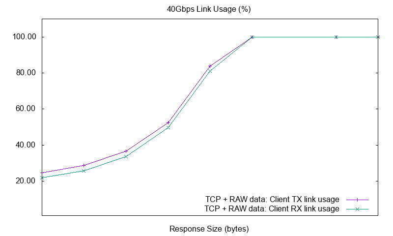
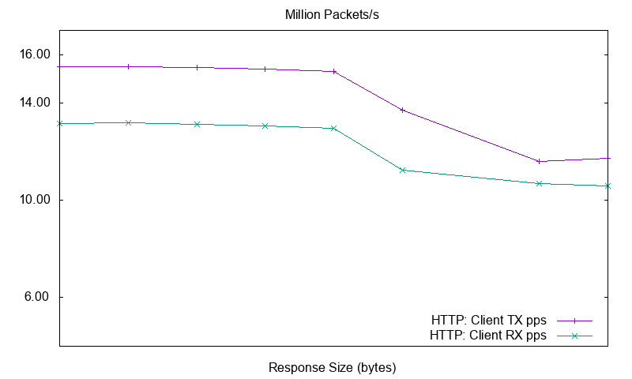
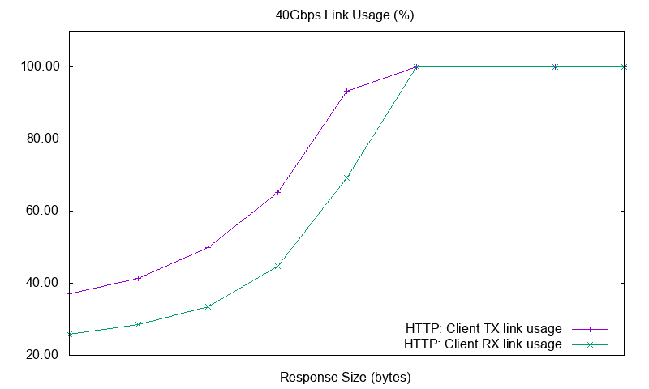
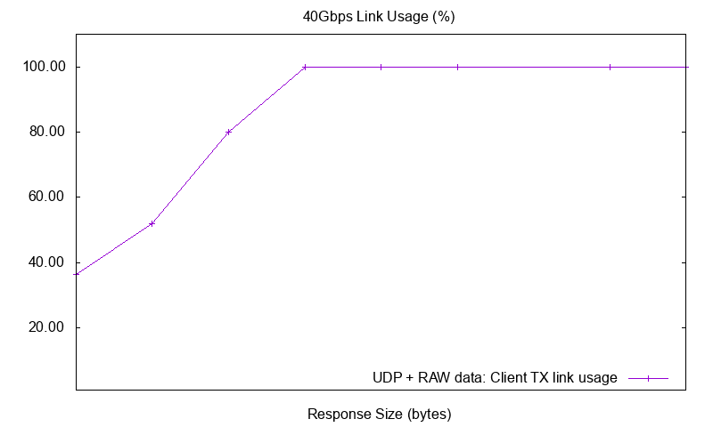

<div align="center">
  
</div>

_WARP17, The Stateful Traffic Generator for L1-L7_ is a lightweight solution
for generating high volumes of session based traffic with very high setup
rates. WARP17 currently focuses on L5-L7 application traffic (e.g., _HTTP_)
running on top of TCP as this kind of traffic requires a complete TCP
implementation.
Nevertheless, WARP17 also supports application traffic running on top of UDP.

Developing network components or services usually requires expensive
proprietary solutions for validating the implemented functionalities and
scalability or performance requirements.
WARP17 is a platform agnostic tool based on [DPDK](http://dpdk.org/) which:

* allows extremely fast generation and sustaining of stateful sessions
* offers configurable TCP/UDP infrastructure which can be used for generating
  high connection setup and data rates for application traffic
* is [Linux](https://kernel.org/) based so all the openly available tools can
  be integrated by the users of WARP17.

The WARP17 TCP/IP implementation runs completely in user-space thus avoiding
the additional latency in the kernel stack. From a hardware perspective,
WARP17 will be able to run on all the platforms that are supported by DPDK.

# Performance benchmarks

## Reference platform HW configuration
The configuration of the server on which the WARP17 benchmarks were run is:

* [Super X10DRX](www.supermicro.com/products/motherboard/Xeon/C600/X10DRX.cfm)
  dual socket motherboard
* Two [Intel&reg; Xeon&reg; Processor E5-2660 v3](http://ark.intel.com/products/81706/Intel-Xeon-Processor-E5-2660-v3-25M-Cache-2_60-GHz)
* 128GB RAM, using 16x 8G DDR4 2133Mhz to fill all the memory slots
* 2 40G [Intel&reg; Ethernet Converged Network Adapter XL710-QDA1](http://ark.intel.com/products/83966/Intel-Ethernet-Converged-Network-Adapter-XL710-QDA1)

__NOTE__: In order for the best performance to be achieved when running only
one instance of WARP17, both NICs have to be installed on the same PCI bus. In
our case the two XL710 40G adapters were both installed on __socket 1__.

For all tests we used the following WARP17 configuration (detailed descriptions
of the command line arguments can be found in the [WARP17 command-line arguments](#warp17-command-line-arguments) section):

* The 40G adapters were connected back to back
* 22 lcores (hardware threads): `-c 0xFFC00FFC03`
	- 20 lcores (10-19, 30-39) were reserved for generating/receiving
	  traffic
	- 2 lcores are used for management of the test
* 32GB RAM memory allocated from hugepages: `-m 32768`

Three types of session setup benchmarks were run, __while emulating both
the servers and the clients__ when using 10 lcores for each ethernet port:

* TCP sessions with raw (random) application payload
* TCP sessions with __real__ HTTP payload
* UDP traffic with raw (random) payload

For each type of traffic 3 charts are presented with results collected
when running the test with different request (top scale of each chart)
and response (bottom scale of each chart) message sizes. These charts
show the client port:

* Session setup rate
* Packets per second transmitted and received
* Ethernet link utilization (percentage of 40G)

It is interesting to see that when emulating real HTTP traffic on top of
4 million TCP sessions, WARP17 can easily exhaust the 40Gbps throughput of
the link.

NOTE: the script used to obtain the benchmark results is available in the
codebase at `examples/python/test_2_perf_benchmark.py`. The script spawns WARP17
for each of the test configurations we were interested in.

## TCP setup and data rates for RAW application traffic

__NOTE__: In the case when we only want to test the TCP control implementation
(i.e., the TCP 3-way handshake and TCP CLOSE sequence), WARP17 achieved the
maximum setup rate of 3.4M clients/s and 3.4M servers/s, __so a total of
6.8M TCP sessions are handled every second__.

The tests set up 4 million TCP sessions (i.e., 4 million TCP clients and 4
million TCP servers) on which clients continuously send fixed size requests
(with random payload) and wait for fixed size responses from the servers.
The tests stop after all the clients sent at least one request.

* TCP raw traffic setup rate (clients and servers) varies between
  __1.8M sess/s__ when sending small requests and responses and
  __1.4M sess/s__ when using bigger messages:


* TCP raw traffic packets per second :


* TCP raw traffic link utilization reaches line rate (40Gbps) as we increase
  the size of the requests and responses:



## TCP setup and data rates for HTTP application traffic

The tests set up 4 million TCP sessions (i.e., 4 million TCP clients and 4
million TCP servers) on which the clients continuously send _HTTP GET_
requests and wait for the _HTTP_ responses from the servers.
The tests stop after all the clients sent at least one request.

* HTTP traffic setup rate (clients and servers) varies between __1.8M sess/s__
  when sending small requests and responses and __1.3M sess/s__ when using
  bigger messages.


* HTTP traffic packets per second:



* HTTP traffic link utilization reaches line rate (40Gbps) as we increase the
  size of the requests and responses:



## UDP setup and data rates for RAW application traffic

The tests continuously send UDP fixed size requests size requests (with random
payload) from 4 million clients and wait for fixed size responses from the servers.
The tests stop after 4 million clients sent at least one request.

* UDP raw traffic packets per second varies between __22.5M pkts/s__ when
  sending small requests and __9.5M pkts/s__ when sending bigger packets:


* UDP raw traffic link utilization:



# Installing and configuring

## Prerequisites

Any 64 bit Linux distribution will do, however we have been testing this with
Ubuntu Server 14.04 LTS. In addition we have made an OVF virtual machine image
available, details can be found in the respective [documentation](ovf/README.md).

### Install build essential, python and ncurses
```
sudo apt-get install build-essential python ncurses-dev
```

### Install DPDK 16.11

* Download [DPDK 16.11](http://dpdk.org/rel/)

	```
	tar xf dpdk-16.11.tar.xz
	cd dpdk-16.11
	```

* Install DPDK:

	```
	make config T=x86_64-native-linuxapp-gcc
	make
	sudo make install
	```

* Load the `igb_uio` DPDK module, either as shown below or by running the
  `$RTE_SDK/tools/dpdk-setup.sh` script and selecting option
  `[16] Insert IGB UIO module`:

	```
	sudo modprobe uio
	sudo insmod x86_64-native-linuxapp-gcc/kmod/igb_uio.ko
	```

* Enable at least 32 1G hugepages and configure them (see section 2.3.2.1 from
the [DPDK Guide](http://dpdk.org/doc/guides/linux_gsg/sys_reqs.html)):
	- add the following line to `/etc/default/grub`:

		```
		GRUB_CMDLINE_LINUX="default_hugepagesz=1G hugepagesz=1G hugepages=32"
		```

   - update grub:

		```
		sudo update-grub
		```

   - reboot the machine

		```
		sudo reboot
		```

* Mount hugepages (see section 2.3.2.2 from the
[DPDK Guide](http://dpdk.org/doc/guides/linux_gsg/sys_reqs.html)):
    - add the mountpoint:

		```
		sudo mkdir /mnt/huge_1GB
		```

    - make the mountpoint permanent by adding to `/etc/fstab`:

		```
		nodev           /mnt/huge_1GB   hugetlbfs pagesize=1GB  0       0
		```

* Export the path to the DPDK SDK (where DPDK was installed) into the variable
RTE_SDK. For example:

	```
	export RTE_SDK=/usr/local/share/dpdk
	```

* Export the target of the DPDK SDK into the variable RTE_TARGET. For example:

	```
	export RTE_TARGET=x86_64-native-linuxapp-gcc
	```

### Install Google Protocol Buffers

* First install the protobuf compilers and python libraries.

	```
	sudo apt-get install protobuf-compiler libprotobuf-dev python-protobuf
	```

* If using Ubuntu Server 14.04 LTS then just install:

	```
	sudo apt-get install libprotobuf-c0 libprotobuf-c0-dev libprotobuf8 libprotoc8 protobuf-c-	compiler
	```

* Otherwise (Ubuntu version >= 15.10):
 * Install [libprotobuf-c](http://packages.ubuntu.com/trusty/amd64/libprotobuf-c0/download),
   [libprotobuf-c-dev](http://packages.ubuntu.com/trusty/amd64/libprotobuf-c0-dev/download)
   from Ubuntu 14.04LTS:

		```
		sudo dpkg -i libprotobuf-c0_0.15-1build1_amd64.deb
		sudo dpkg -i libprotobuf-c0-dev_0.15-1build1_amd64.deb
		```

 * Install [libprotobuf8](http://packages.ubuntu.com/trusty/amd64/libprotobuf8/download)
   from Ubuntu 14.04LTS:

		sudo dpkg -i libprotobuf8_2.5.0-9ubuntu1_amd64.deb

 * Install [libprotoc8](http://packages.ubuntu.com/trusty/amd64/libprotoc8/download)
   from Ubuntu 14.04LTS:

		sudo dpkg -i libprotoc8_2.5.0-9ubuntu1_amd64.deb

 * Install [protobuf-c-compiler](http://packages.ubuntu.com/trusty/amd64/protobuf-c-compiler/download)
   from ubuntu 14.04LTS:

		sudo dpkg -i protobuf-c-compiler_0.15-1build1_amd64.deb

## Get WARP17
Get the `warp17-<ver>.tgz` archive or clone the desired release.

## Compile WARP17

```
tar xfz warp17-<ver>.tgz
cd warp17
make
```

## Configure Python virtualenv

```
sudo apt-get install python-pip
sudo pip install virtualenv
virtualenv warp17-venv
source warp17-venv/bin/activate
pip install -r python/requirements.txt
```

Once installed, whenever python tests need to run the virtual environment must
be activated:

```
source warp17-venv/bin/activate
```

To exit the virtual environment and return to the default python interpretor
and libraries:

```
deactivate
```

## Configure DPDK ports

Use the `$RTE_SDK/tools/dpdk-setup.sh` script (as described in the
[DPDK Guide](http://dpdk.org/doc/guides/linux_gsg/quick_start.html)). Select
which ports to be controlled by the IGB UIO module: option `[22] Bind
Ethernet/Crypto device to IGB UIO module`.

# How to run

From the top directory of WARP17:

```
./build/warp17 <dpdk-command-line-args> -- <warp17-command-line-args>
```

## Running as non-root

After compiling WARP17 change the owner of the binary to `root` (in order to
allow access to `/proc/self/pagemap`:):

```
sudo chown root build/warp17
```

Set the `suid` bit on the binary in order to allow the user to keep
permissions:

```
sudo chmod u+s build/warp17
```

## Command-line arguments

### DPDK command-line arguments

* `-c <hex_mask>`: bitmask specifying which physical cores the application
  will use. Each bit corresponds to a physical core (0-`<max_cores>`).
* `-n <chan_no>` : number of memory channels to be used.
* `-m <mem_in_MB>`: total memory available to the application (in MB).

Please check section 3.1 of the
[DPDK App Guide](http://dpdk.org/doc/guides/testpmd_app_ug/run_app.html) for
more info about DPDK command-line arguments.

__NOTE: For now WARP17 supports at most 64 cores.__

### WARP17 command-line arguments

* `--qmap <port>.<hex_mask>`: bitmask specifying which physical cores will
  control the physical port <eth_port>.
* `--qmap-default max-c`: maximize the number of independent cores handling
  each physical port.
* `--qmap-default max-q`: maximize the number of transmit queues per physical
  port.
* `--tcb-pool-sz`: configure the size of the TCP control block pool (one TCB is
  used per TCP connection endpoint). The size of the pool will be given by the
  argument of this option multiplied by 1024. By default 10M TCBs are
  allocated.
* `--ucb-pool-sz`: configure the size of the UDP control block pool (one UCB is
  used per UDP connection endpoint). The size of the pool will be given by the
  argument of this option multiplied by 1024. By default 10M UCBs are
  allocated.
* `--mbuf-pool-sz`: configure the size of the packet pool. The size of the
  pool will be given by the argument of this option multiplied by 1024. By
  default 768K packets are allocated.
* `--mbuf-hdr-pool-sz`: configure the size of the packet headers pool. The
  size of the pool will be given by the argument of this option multiplied by
  1024. By default 512K packet headers are allocated.
* `--ring-if-pairs`: configure the number of _in-memory-ring-based_ interfaces.
  __NOTE: please check section
  [Using In-Memory-Ring-Based Interfaces](#using-in-memory-ring-based-interfaces)
  for more information.__
* `--kni-ifs`: configure the number of _kni_ interfaces.
  __NOTE: please check section
  [Using Kernel Network Interface (KNI) Interfaces](#using-kernel-network-interface-kni-interfaces) for more information.__

* `--cmd-file=<file>`: CLI command file to be executed when the application
  starts

__NOTE: Options qmap, qmap-default max-c/max-q, cannot be combined. Only one can
be passed at a given time.__

__NOTE: Users are encouraged to use the "qmap-default max-q" option whenever
ethernet ports are on the same socket as the PKT cores as this usually gives
the best performance!__

__NOTE: The lowest two cores will be dedicated to CLI and management processing,
and can not be assigned to a physical port for packet processing using the
`--qmap` option!__

### Example (on a x86 server with 32G RAM for WARP17 and 4 memory channels):

* Determine the number of physical cores:

	```
	$ lscpu | grep "CPU(s)"
	CPU(s):                12
	```

	Decide how many cores WARP17 should use. In this example we consider WARP17
    uses 8 cores:
	- cores 6, 7, 8, 9, 10, 11 for packet processing
	- cores 0, 1 for CLI and management

	Based on that we determine the bitmask corresponding to the ids of the cores
    we would like to use. The bit index in the bit mask corresponds to the core
    id:

	```
	Bitmask:  0  0  0  0      1   1  1  1     1  1  0  0     0  0  1  1 => 0xFC3
	Bit idx: 15 14 13 12     11  10  9  8     7  6  5  4     3  2  1  0
	```

	This corresponds to the `-c` command line argument.

* Determine the number of memory channels:

	```
	$ dmidecode | grep Channel
	    Bank Locator: P0_Node0_Channel0_Dimm0
	    Bank Locator: P0_Node0_Channel1_Dimm0
	    Bank Locator: P0_Node0_Channel2_Dimm0
	    Bank Locator: P0_Node0_Channel3_Dimm0  <<<< the system has 4 channels (0-3)
	```

	The `-n` command line argument should be usually set to the max number of
	channels available in the system.

    WARP17 should be using 32G of memory in this example so the `-m` command
    line argument should be set to 32768.

	In order for WARP17 to use the default core to port mapping while
	maximizing the number of transmit queues the `--qmap-default` command line
	argument should be set to `max-q`.

* _Optional_: the startup commands file can be specified through the `--cmd-file`
command line argument.

For our example this translates into the following command:

```
./build/warp17 -c FC3 -n 4  -m 32768 -- --qmap-default max-q --tcb-pool-sz 32768 --cmd-file cfg.txt
```

which will start WARP17 with:

* 8 cores to be used by the application (`-c FC3`):
    - 2 cores will be used by CLI and MGMT
    - 6 cores for processing packets
* 4 mem channels (`-n 4`)
* 32G of available memory (`-m 32768`)
* all 6 PKT cores will process all physical ports (`--qmap-default max-q`)
* allocates 32 million TCBs (`--tcb-pool-sz 32768`): for the configs in the
  examples sections we need 20M TCBs, i.e., 10M clients and 10M servers.
* will execute the CLI commands in file cfg.txt after starting WARP17

### Using In-Memory-Ring-Based Interfaces

WARP17 can also be run when no physical interface is available. This is
especially useful when developing new features as it removes the requirement
of a specific hardware configuration. It also allows users to quickly try out
WARP17 on their own laptop/VM.

_In-Memory-Ring-Based Interfaces_ (let's just call them _ring interfaces_)
are always created in pairs. The two interfaces in a pair act as if they
would be physical interfaces connected back to back.

By default the support for ring interfaces is disabled. However the user can
easily enable it by compiling WARP17 with the following command:

```
make all-ring-if
```

Using the `--ring-if-pairs <number>` command line argument the user can
specify the number of ring interface pairs that WARP17 will create. Updating
the previous command line example we end up with:

```
./build/warp17 -c FC3 -n 4  -m 32768 -- --qmap-default max-q --tcb-pool-sz 32768 --ring-if-pairs 1 --cmd-file cfg.txt
```

This will start WARP17 and add a pair of ring interfaces connected back to
back.

The user can also use custom queue mappings for ring interfaces. The ring
interface pairs are always created after physical interfaces. This means that
their IDs will be allocated in order after physical IDs. For example:

```
./build/warp17 -c FC3 -n 4  -m 32768 -w 0000:82:00.0 -- --ring-if-pairs 1
```

This will start WARP17 with three interfaces (one physical and two ring
interfaces). The physical interface (`0000:82:00.0`) will have ID 0 while
the two ring interfaces will have IDs 1 and 2.

__NOTE: There's a restriction in place when using ring interfaces: the user
must make sure that the same number of TX/RX queues is created through qmaps
for both ring interfaces in a pair. Otherwise the command line will be
rejected.__

### Using Kernel Network Interface (KNI) Interfaces

WARP17 can also be run with a virtual interface into the Linux kernel. This
is especially useful when developing a new protocol and you want to test it
agains a known working server or client. See the HTTP example below.

By default the support for KNI interfaces is disabled. However the user can
easily enable it by compiling WARP17 with the following command:

```
make all-kni-if
```

Using the `--kni-ifs <number>` command line argument the user can specify
the number of KNI interfaces that WARP17 will create. Updating
the previous command line example we end up with:

```
./build/warp17 -c FC3 -n 4  -m 32768 -- --qmap-default max-q --tcb-pool-sz 32768 --kni-ifs 2 --cmd-file cfg.txt
```

The user can also use custom queue mappings for KNI interfaces, however they
can only be assigned to a single core. The KNI interfaces are always created
after the physical and ring interfaces. This means that
their IDs will be allocated in order after physical IDs. For example:

```
./build/warp17 -c FC3 -n 4  -m 32768 -w 0000:82:00.0 -- --ring-if-pairs 1 --kni-ifs 2
```

This will start WARP17 with five interfaces (one physical, two ring
interfaces and two KNI interfaces). The physical interface (`0000:82:00.0`)
will have ID 0, the two ring interfaces will have IDs 1 and 2, and the two
KNI interfaces will have IDs 3 and 4.

For the example above the two Kernel interfaces will be named `warp3` and `warp4`,
so the naming convention is `warp<eth_port>`

The following example will show how to use the KNI interface to get some HTTP
data from the built in HTTP server trough Linux. We assume no physical ports
are configured, if you have them make sure you increase all the referenced
ports:

* Load the `rte_kni` DPDK module, either as shown below or by running the
  `$RTE_SDK/tools/dpdk-setup.sh` script and selecting option
  `[18] Insert KNI module`:

```
sudo insmod $RTE_SDK/x86_64-native-linuxapp-gcc/kmod/rte_kni.ko
```

* Start WARP17:

```
./build/warp17 -c FC3 -n 4  -m 32768 -- --kni-ifs 1
```

* Configure the Linux kernel interface:

```
sudo ip link set warp0 up
sudo ip addr add 172.16.1.1/24 dev warp0
```

* Configure WARP17 as follows:

```
add tests l3_intf port 0 ip 172.16.1.2 mask 255.255.255.0
add tests l3_gw port 0 gw 172.16.1.1
add tests server tcp port 0 test-case-id 0 src 172.16.1.2 172.16.1.2 sport 80 80
set tests server http port 0 test-case-id 0 200-OK resp-size 2000
start tests port 0
```

* Now do a HTTP request using wget:

```
[WARP17:~]$ wget 172.16.1.2
--2016-10-25 11:40:43--  http://172.16.1.2/
Connecting to 172.16.1.2:80... connected.
HTTP request sent, awaiting response... 200 OK
Length: 2000 (2.0K)
Saving to: ‘index.html’

index.html                         100%[================================================================>]   1.95K  --.-KB/s   in 0s

2016-10-25 11:40:43 (478 MB/s) - ‘index.html’ saved [2000/2000]
```


# CLI

## Test configuration commands

__NOTE: Only IPv4 is supported for now!__

* __Configure Ethernet Port MTU__:

	```
	set tests mtu port <eth_port> <mtu-value>
	```

* __Add L3 interfaces__: configure an IP interface with the specified `ip`
  address and `mask`. Currently only 10 IP interfaces are supported per port.

	```
	add tests l3_intf port <eth_port> ip <ip> mask <mask>
	```

* __Add L3 default gateway__: configure 'gw' as the default gateway for
  `eth_port`.

	```
	add tests l3_gw port <eth_port> gw <gw_ip>
	```

* __Configure server test cases__: configure a server test case with ID
  `test-case-id` on `eth_port`. The underlying L4 traffic can be TCP or UDP.
  `ip_range` and `port_range` define the `<ip:port>` sockets on which the
  servers will be listening. By default, the application (L5-L7) traffic will
  be RAW traffic.

	```
	add tests server tcp|udp port <eth_port> test-case-id <tcid>
	                 src <ip_range> sport <port_range>
	```

* __Configure client test cases (per port)__: configure a client test case with
  ID `test-case-id` on `eth_port`. The underlying L4 traffic can be TCP or UDP.
  The source IP/l4-port and destination IP/l4-port ranges define the
  `<src_ip, src_port:dst_ip, dst_port>` TCP/UDP connections that will be
  established. By default, the application (L5-L7) traffic will be RAW traffic.

	```
	add tests client tcp|udp port <eth_port> test-case-id <tcid>
	                 src <ip-range> sport <l4-ports>
	                 dest <ip-range> dport <l4-ports>
	```

* __Configure test profile timeouts__: each test has a specific timeout profile
  which is defined by the initial delay after which client connections are
  initiated, how long a connection should live and how long a connection should
  stay down (after closing) before the client reconnects.

    - __initial_delay__: amount of time (in seconds) the clients defined in the
      test should wait before initiating a connection. `infinite` is allowed but
      doesn't really make sense for the initial delay as it would cause the
      clients to never initiate a connection.

		```
		set tests timeouts port <eth_port> test-case-id <tcid> init <timeout>|infinite
		```
    - __conn_uptime__: amount of time (in seconds) the clients defined in the
      test should keep the connection up (and send application traffic) before
      initiating a close. `infinite` allows the clients to stay up forever.

		```
		set tests timeouts port <eth_port> test-case-id <tcid> uptime <timeout>|infinite
		```
    - __conn_downtime__: amount of time (in seconds) the clients defined in the
      test should keep the connection down after a closebefore initiating a
      reconnect. `infinite` allows the clients to stay down forever.

		```
		set tests timeouts port <eth_port> test-case-id <tcid> downtime <timeout>|infinite
		```

* __Configure test profile rates__: each test has a specific rate limiting
  profile which is defined by the connection open, close and send rate.

    - __setup rate__: number of connections that the clients in the test are
      allowed to initiate __per second__. `infinite` removes any rate limiting
      for initiating sessions (i.e., WARP17 will try to do it as fast as possible).

		```
		set tests rate port <eth_port> test-case-id <tcid> open <rate>|infinite
		```
    - __close rate__: number of connections that the clients in the test are
      allowed to close __per second__. `infinite` removes any rate limiting for
      closing sessions (i.e., WARP17 will try to do it as fast as possible).

		```
		set tests rate port <eth_port> test-case-id <tcid> close <rate>|infinite
		```
    - __data rate__: number of connections that the clients in the test are
      allowed to send traffic on __per second__. `infinite` removes any rate
      limiting for sending traffic (i.e., WARP17 will try to do it as fast as
      possible).

		```
		set tests rate port <eth_port> test-case-id <tcid> send <rate>|infinite
		```

* __Configure test criteria__: different criteria can be configured for each
  test case. The criteria will be used for declaring a test as _PASSED_ or
  _FAILED_.
    - __run-time__: declare the test case with ID `tcid` as _PASSED_ after
      `value` seconds.

		```
		set tests criteria port <eth_port> test-case-id <tcid> run-time <count>
		```
    - __servers-up__: declare the test case with ID `tcid` as _PASSED_ when
      `count` servers are UP (listening for incoming connections).

		```
		set tests criteria port <eth_port> test-case-id <tcid> servers-up <count>
		```
    - __clients-up__: declare the test case with ID `tcid` as _PASSED_ when
      `count` clients are UP (ready to initiate a connection).

		```
		set tests criteria port <eth_port> test-case-id <tcid> clients-up <count>
		```
    - __clients-established__: declare the test case with ID `tcid` as _PASSED_
      when `count` clients have established a connection.

		```
		set tests criteria port <eth_port> test-case-id <tcid> clients-estab <count>
		```
    - __data-MB__: declare the test case with ID `tcid` as _PASSED_ when
      `count` MB of data have been sent. __NOTE: NOT supported yet!__

		```
		set tests criteria port <eth_port> test-case-id <tcid> data-MB <count>
		```

* __Configure tests as _asynchronous_:__ if multiple test cases are defined on
  the same `eth_port`, by default, they will be executed in sequence (when a
  test case ends the next one is started). To change the behaviour the user can
  mark a test case as _async_ forcing the test engine to advance to the next
  configured test case without waiting for the current one to finish.

	```
	set tests async port <eth_port> test-case-id <tcid>
	```

* __Delete test cases__: delete a configured test case with ID `tcid` from port
  `eth_port`.

	__NOTE: if a test case is already running it has to be stopped
	before it can be deleted!__

	```
	del tests port <eth_port> test-case-id <tcid>
	```

* __Start tests__: start all the test cases configured on `eth_port`. Test
  cases will be started in sequence (after the previous test case ended) except
  for the ones that are marked as _async_.

	```
	start tests port <eth_port>
	```

* __Stop tests__: stop all the test cases currently running on `eth_port`.

	```
	stop tests port <eth_port>
	```

* __Customize TCP stack settings__: customize the behavior of the TCP stack
  running on test case with ID `tcid` on port `eth_port`. The following
  settings are customizable:

  	- `win-size`: the size of the TCP send window.

		```
		set tests tcp-options port <eth_port> test-case-id <tcid> win-size <size>
		```

  	- `syn-retry`: number of times to retry sending `SYN` packets before
  	  aborting the connection.

		```
		set tests tcp-options port <eth_port> test-case-id <tcid> syn-retry <cnt>
		```

  	- `syn-ack-retry`: number of times to retry sending `SYN + ACK` packets
  	  before aborting the connection.

		```
		set tests tcp-options port <eth_port> test-case-id <tcid> syn-ack-retry <cnt>
		```

  	- `data-retry`: number of times to retry sending data packets before
  	  aborting the connection.

		```
		set tests tcp-options port <eth_port> test-case-id <tcid> data-retry <cnt>
		```

  	- `retry`: number of times to retry sending other control packets before
  	  aborting the connection.

		```
		set tests tcp-options port <eth_port> test-case-id <tcid> retry <cnt>
		```

  	- `rto`: retransmission timeout (in ms) to be used before retransmitting
  	  a packet.

		```
		set tests tcp-options port <eth_port> test-case-id <tcid> rto <rto_ms>
		```

  	- `fin-to`: `FIN` timeout (in ms) in order to avoid staying in state
  	  `FIN-WAIT-II` forever.

		```
		set tests tcp-options port <eth_port> test-case-id <tcid> fin-to <fin_to_ms>
		```

  	- `twait-to`: `TIME-WAIT` timeout (in ms) to wait before cleaning up the
  	  connection.

		```
		set tests tcp-options port <eth_port> test-case-id <tcid> twait-to <twait_to_ms>
		```

    - `orphan-to`: `ORPHAN` timeout (in ms) in order to avoid staying in state
      `FIN-WAIT-I` forever.

		```
		set tests tcp-options port <eth_port> test-case-id <tcid> orphan-to <orphan_to_us>
		```

    - `twait_skip`: boolean to decide if state `TIME-WAIT` should be skipped or
      not.

		```
		set tests tcp-options port <eth_port> test-case-id <tcid> twait-skip <true|false>
		```

## Application configuration and statistics commands

Currently only _RAW TCP_ (L5-L7 payload is random) and a sub-set of _HTTP 1.1_
(_GET_/_HEAD_ and _200 OK_/_404 NOT FOUND_) traffic is supported.

Before configuring the application behavior the user must have previously
defined the client or server test cases.

* __HTTP 1.1 application traffic__: the _HTTP 1.1_ application allows the user
  to simulate different types of HTTP requests (for clients) and responses
  (for servers):
    - __HTTP 1.1 client configuration__: _GET_/_HEAD_ requests are supported. A
      `req-size` must also be specified (0 is also valid) in order to define
      the size of the body of the HTTP request.

		```
		set tests client http port <eth_port> test-case-id <tcid> GET|HEAD <host-name> <obj-name> req-size <req-size>
		```

    - __HTTP 1.1 server configuration__: _200 OK_/_404 NOT FOUND_ responses are
      supported. A `resp-size` must also be specified (0 is also valid) in order
      to define the size of the body of the HTTP response.

		```
		set tests server http port <eth_port> test-case-id <tcid> 200-OK|404-NOT-FOUND resp-size <resp-size>
		```

    - __HTTP 1.1 global stats__: display (detailed) statistics for the ethernet ports
      currently in use (e.g., allocation errors/parse errors). If detailed
      stats are requested then the information is displayed per port + lcore.

		```
		show http statistics [details]
		```

* __RAW application traffic__: the RAW application emulates _request_ and
  _response_ traffic. The client sends a request packet of a fixed configured
  size and waits for a fixed size response packet from the server. The user
  should configure the _request_/_response_ size for both client and server
  test cases.

	__NOTE: the user has to make sure that the _request_/_response_
	sizes match between clients and servers!__

	```
	set tests client raw port <eth_port> test-case-id <tcid>data-req-plen <len> data-resp-  plen <len>
	```

	```
	set tests server raw port <eth_port> test-case-id <tcid>data-req-plen <len> data-resp-  plen <len>
	```

## Displaying test information

* __Current test configuration__: the current test configuration (including per
  port L3 interfaces and default gateway) will be displayed for a given ethernet
  port.

	```
	show tests config port <eth_port>
	```

* __Current test state__: the current test state (including per test case
  quick statistics) will be displayed for a given ethernet port.

	```
	show tests state port <eth_port>
	```

* __Detailed test statistics__: the detailed test staistics will be displayed
for a given ethernet port and test-case.

	```
	show tests stats port <eth_port> test-case-id <tcid>
	```

## Statistics and operational information

Different types of statistics can be dumped from the CLI. Currently all these
stats are not directly linked to any test case ID but they are aggregate per
ethernet port.

* __Port information and statistics__
    - __Port information__: display general port information.

		```
		show port info
		```

    - __Port-core mappings__: display the mappings between ethernet port RX/TX
      queues and lcore IDs. The socket IDs of the ports and lcores are also
      displayed.

		__NOTE: Having lcores handling ports that have their PCI bus on a different
		socket than the lcore will affect performance!__

		```
		show port map
		```

    - __Port link information__: display the current link status of the ethernet
      ports.

		```
		show port link
		```

    - __Port statistics__: display (detailed) statistics for the ethernet ports
      currently in use (e.g., _received/transmitted packets/bytes_). If detailed
      stats are requested then the information is displayed per port + lcore.

		```
		show port statistics [details]
		```

* __Ethernet statistics__: display (detailed) statistics regarding the Ethernet
  layer processing (e.g., _ethernet type, errors_). If detailed stats are
  requested then the information is displayed per port + lcore.

	```
	show ethernet statistics [details]
	```

* __ARP information and statistics__
    - __ARP tables__: display the ARP tables for each ethernet port currently in
      use. For now L3 interfaces are defined per ethernet port and not per test
      case ID. This enforces a unique ARP table per port.

		__NOTE: The current ARP implementation is limited in the sense that whenever tests
		are started on a port, gratuituous ARPs are sent for all the L3 interfaces that were
		defined on that port and an ARP request is sent for the default gateway.
		All ARP requests and replies are properly processed but there is no timeout
		mechanism in place for aging entries!__

		```
		show arp entries
		```

    - __ARP statistics__:  display (detailed) statistics regarding ARP
      processing (e.g., _request/response count, errors_). If detailed stats
      are requested then the information is displayed per port + lcore.

		```
		show arp statistics [details]
		```

* __Route statistics__: display (detailed) statistics for the routing module
  (e.g., _interface/gateway creation/deletion count, errors_). The current
  routing implementation is minimal and only handles L3 interface
  creation/deletion and default gateways.

	```
	show route statistics [details]
	```

* __IPv4 statistics__: display (detailed) statistics regarding IPv4 processing
  (e.g., _received packet/bytes counts, per L4 protocol counters, errors_). If
  detailed stats are requested then the information is displayed per
  port + lcore.

	```
	show ipv4 statistics [details]
	```

* __TCP statistics__: display (detailed) statistics regarding TCP processing
  (e.g., _received packets/bytes counts, sent control/data packets/bytes counts,
  allocation counters, errors_). If detailed stats are requested then the
  information is displayed per port + lcore.

	```
	show tcp statistics [details]
	```

* __TCP state machine statistics__: display (detailed) statistics regarding
  TCP state machine processing (e.g., _per TCP state counters, retransmission
  counters, missing sequence counters_). If detailed stats are requested then
  the information is displayed per port + lcore.

	```
	show tsm statistics [details]
	```

* __UDP statistics__: display (detailed) statistics regarding UDP processing
  (e.g., _received packets/bytes counts, sent packets/bytes counts, allocation
  counters, errors_). If detailed stats are requested then the information
  is displayed per port + lcore.

	```
	show udp statistics [details]
	```

* __Timer statistics__: there are currently three types of supported timers:
  _fast_ retransmission timers, slow_ timers (e.g., TIME-WAIT) and _test_
  timers. _Test_ timers are used by the test engine and the others are used
  by the TCP/UDP stack implementations. The command displays (detailed)
  statistics regarding these types of timers. If detailed stats are requested
  then the information is displayed per port + lcore.

	```
	show timer statistics [details]
	```

## Infrastructure statistics

* __Message queues statistics__: all communication between lcores (PKT or CLI)
  is done by means of message passing. Each lcore has two message queues (a
  local and a global queue storing messages based on the originator of the
  message). The command displays (detailed) statistics regarding the message
  queues (e.g., _messages sent/received/allocated, errors_). If detailed stats
  are requested then the information is displayed per port + lcore.

	```
	show msg statistics [details]
	```

* __Memory statistics__: most of the memory used during the tests is allocated
  from different mempools (mbufs, TCP/UDP control blocks). The command displays
  (detailed) statistics regarding the usage of the memory pools. If detailed
  stats are requested then the information is displayed per port + lcore.

	```
	show memory statistics [details]
	```

# UI

`show tests ui` displays an UI which allows monitoring the test execution.

The UI is split in 4 main areas:

* test status area
* detailed test statistics area: Open/Closed/Send statistics and Application
  statistics are displayed for the currently selected test case.
* detailed test configuration area: display the complete configuration of the
  currently selected test case. The user can navigate between test cases
  by pressing `n` for moving to the next test case and `b` for moving to the
  previous test case. Switching between the configuration view and statistics
  view can be done using the `c` and `s` keys.
* statistics area: for each of the ethernet ports various statistics will be
  displayed for all levels of the TCP/IP stack.

# Example run
Some example configuration files can be found in the `examples/` directory. The
configuration files can either be passed as a command-line argument, `--cmd-file=<file>`, when running
WARP17 or executed directly in the CLI.

* __examples/test\_1\_raw\_tcp\_connection.cfg__: single TCP client-server
  connection on a back to back setup using _RAW_ application data (requests of
  size 100 and responses of size 200 bytes). The client connects immediately
  when the test starts and sends requests continuously (and waits for responses)
  until the `uptime` expires (5 seconds), closes the connection and reconnects
  after the `downtime` expires (15 seconds).

* __examples/test\_2\_raw\_udp\_connection.cfg__: single UDP client-server
  connection on a back to back setup using _RAW_ application data (requests of
  size 100 and responses of size 200 bytes). The client connects with a delay
  of 10 seconds (`init`) then sends requests continuously (and waits for
  responses) until the `uptime` expires (5 seconds), closes the connection and
  reconnects `downtime` expires (15 seconds).

* __examples/test\_3\_http\_multiple.cfg__: two client test cases each with a
  single HTTP client. The first client test case sends _GET_ requests while
  the second one sends _HEAD_ requests. The first test case is marked as
  _async_ which will determine WARP17 to start both of them in parallel. The
  HTTP server test case is configured to reply with _200 OK_.

* __examples/test\_4\_http\_10M_sessions.cfg__: single test case per port
  configuring 10M HTTP sessions. The test case on port 0 will establish
  connections from `10.0.0.1:[10000, 60000)` to `10.0.0.253:[6000, 6200)`.
  On each of those connections HTTP _GET_ requests will be sent continuously
  until the `uptime` of 30 seconds expires. Then the connections are closed.
  After another 15 seconds of `downtime` the clients reconnect and start over.

* __examples/test\_5\_raw\_10M\_sessions.cfg__: single test case per port
  configuring 10M RAW sessions. The test case on port 0 will establish
  connections from `10.0.0.1:[10000, 60000)` to `10.0.0.253:[6000, 6200)`.
  On each of those connections RAW requests of size 1K will be sent
  continuously. `uptime` is configured as `infinite` so the clients will
  stay UP forever. If the connection goes down (e.g., TCP session fails)
  then the client will reconnect after a `downtime` of 10 seconds.
  The RAW servers reply with responses of size 4K. The clients are also rate
  limited to 1M sessions/s `open` and 900K sess/s `send` rate (clients will)

* __examples/test\_6\_http\_40M\_sessions.cfg__: single test case per port
  configuring __40M HTTP sessions__. The test case on port 0 will establish
  connections from `[10.0.0.1, 10.0.0.4]:[10000, 60000)` to
  `10.0.0.253:[6000, 6200)`. On each of those connections HTTP _GET_
  requests will be sent continuously.

* __examples/test\_7\_routing\_raw\_8M\_sesssions.cfg__: example config to
  be used when having (multiple) routers in between the client and server
  ports.

# Python scripting API
WARP17 offers an RPC-based API which allows users to write scripts and automate
the tests that WARP17 would run. WARP17 listens to incoming RPC connections on TCP
port `42424`.

The RPC object definitions can be found in the `api/*.proto` files. The main
RPC interface is defined in `api/warp17-service.proto`. All `*.proto` files are
compiled into Python classes when building WARP17. The generated code is saved
in the `api/generated/py` directory (one `.py` file for each `.proto`
definition file).

A short example about how to use the Python API can be found in
`examples/python/test_1_http_4M.py`. The example sets up 4M _HTTP_ clients
and servers, polls for statistics and stops the tests after a while.

# Perl scripting API
WARP17 can also be scripted through Perl by using the `Inline::Python` module.
A short example about how to use Perl to script WARP17 can be found in
`examples/perl/test_1_http_4M.pl`. Requirements for running the Perl scripts:

```
sudo apt-get install python2.7-dev
sudo apt-get install cpanminus
sudo cpanm Inline::Python
```

# Contributing a new L7 Application implementation
WARP17 currently supports _RAW TCP_ and _HTTP 1.1_ application traffic. Even
though we are currently working on adding support for more application
implementations, external contributions are welcome.

As a future development WARP17 will offer a socket API in order to allow
applications to be easily plugged in. Until then any new application must
be directly added to the WARP17 code. As an example, a good starting point
is the _HTTP 1.1_ implementation itself.

In general, an application called `foo` should implement the following:

* `warp17-app-foo.proto` definition file in `api/`: should contain
  the application configuration definitions (for clients and servers) and
  preferably application specific statistics definitions.

  	- `warp17-app-foo.proto` should be included in both
      `warp17-client.proto` and `warp17-server.proto` and the application
      definitions should be added to the `TcpUdpClient` and `TcpUdpServer`
      structures.:

	```
    message TcpUdpClient {
		[...]
	    /* Add different App configs below as optionals. */
	    optional RawClient  ac_raw        = 8  [(warp17_union_anon) = true];
	    optional HttpClient ac_http       = 9  [(warp17_union_anon) = true];
	    optional FooClient  ac_foo	      = 10 [(warp17_union_anon) = true];
	}

	[...]

	message TcpUdpServer {
		[...]
		/* Add different App configs below as optionals. */
		optional RawServer  as_raw       = 2 [(warp17_union_anon) = true];
		optional HttpServer as_http      = 3 [(warp17_union_anon) = true];
		optional FooServer  as_foo       = 4 [(warp17_union_anon) = true];
	}
	```

    - `warp17-app-foo.proto` should also be included in
      `warp17-test-case.proto` and the application specific statistics should
      be added to the `TestCaseAppStats` definition:

	```
    message TestCaseAppStats {
		[...]

		optional RawStats  tcas_raw  = 1 [(warp17_union_anon) = true];
		optional HttpStats tcas_http = 2 [(warp17_union_anon) = true];
		optional FooStats  tcas_foo  = 3 [(warp17_union_anon) = true];
	}
	```

    - a new entry for the application type should be added to the `AppProto`
      enum in `warp17-common.proto`:

	```
	enum AppProto {
		RAW           = 0;
		HTTP          = 1;
		FOO		      = 2;
		APP_PROTO_MAX = 3;
	}
	```

    - the new protocol buffer file (`warp17-app-foo.proto`) should also
      be added to `api/Makefile.api`:

	```
	SRCS-y += tpg_test_app.c
	SRCS-y += tpg_test_http_1_1_app.c
	SRCS-y += tpg_test_raw_app.c
	SRCS-y += tpg_test_foo_app.c
	```

	- include `warp17-app-foo.proto` in `tcp_generator.h`:

	```
	#include "warp17-app-raw.proto.xlate.h"
	#include "warp17-app-http.proto.xlate.h"
	#include "warp17-app-foo.proto.xlate.h"
	```

* RPC WARP17 to protobuf translation code:

	- a new case entry in `tpg_xlate_tpg_union_AppClient` where the client
	  translation function should be called:

	```
	case APP_PROTO__HTTP:
	    out->ac_http = rte_zmalloc("TPG_RPC_GEN", sizeof(*out->ac_http), 0);
	    if (!out->ac_http)
	        return -ENOMEM;

	    tpg_xlate_tpg_HttpClient(&in->ac_http, out->ac_http);
	    break;
	case APP_PROTO__FOO:
	    out->ac_foo = rte_zmalloc("TPG_RPC_GEN", sizeof(*out->ac_foo), 0);
	    if (!out->ac_foo)
	        return -ENOMEM;

	    tpg_xlate_tpg_FooClient(&in->ac_foo, out->ac_foo);
	    break;
	```

	- a new case entry in `tpg_xlate_tpg_union_AppServer` where the server
	  translation function should be called:

	```
	case APP_PROTO__HTTP:
	    out->as_http = rte_zmalloc("TPG_RPC_GEN", sizeof(*out->as_http), 0);
	    if (!out->as_http)
	        return -ENOMEM;

	    tpg_xlate_tpg_HttpServer(&in->as_http, out->as_http);
	    break;
	case APP_PROTO__FOO:
	    out->as_foo = rte_zmalloc("TPG_RPC_GEN", sizeof(*out->as_foo), 0);
	    if (!out->as_foo)
	        return -ENOMEM;

	    tpg_xlate_tpg_FooServer(&in->as_foo, out->as_foo);
	    break;
	```

	- a new case entry in `tpg_xlate_tpg_TestStatusResult` when translating
	  application statistics:

	```
	case APP_PROTO__HTTP:
	    out->tsr_app_stats->tcas_http = rte_zmalloc("TPG_RPC_GEN",
	                                                sizeof(*out->tsr_app_stats->tcas_http),
	                                                0);
	    if (!out->tsr_app_stats->tcas_http)
	        return -ENOMEM;

	    err = tpg_xlate_tpg_HttpStats(&in->tsr_app_stats.tcas_http,
	                                  out->tsr_app_stats->tcas_http);
	    if (err)
	        return err;
	    break;
	case APP_PROTO__FOO:
	    out->tsr_app_stats->tcas_foo = rte_zmalloc("TPG_RPC_GEN",
	                                               sizeof(*out->tsr_app_stats->tcas_foo),
	                                               0);
	    if (!out->tsr_app_stats->tcas_foo)
	        return -ENOMEM;

	    err = tpg_xlate_tpg_FooStats(&in->tsr_app_stats.tcas_foo,
	                                 out->tsr_app_stats->tcas_foo);
	    if (err)
	        return err;
	    break;
	```

* `appl/tpg_test_app.h` interface implementation:

	- application `foo` should be added to the `app_data_t` definition in
	  `inc/appl/tpg_test_app.h`. Type `foo_app_t` should be defined in the
	  application headers and should represent a state storage for the
	  `foo` application. The state is part of the L4 control block structures
	  (TCB/UCB).

	```
	typedef struct app_data_s {

	    tpg_app_proto_t   ad_type;

	    union {
	        raw_app_t     ad_raw;
	        http_app_t    ad_http;
	        foo_app_t     ad_foo;
	        generic_app_t ad_generic;
	    };

	} app_data_t;
	```

	- `foo` must also provide callback functions corresponding to the callback
	  types defined in `inc/appl/tpg_test_app.h`. The callbacks should be
	  added to the callback arrays in `src/appl/tpg_test_app.c`. These
	  functions will be called by the test engine whenever application
	  intervention is required:

		- `app_default_cfg_cb_t`: should initialize the `foo` application
		  config to default values

		- `app_validate_cfg_cb_t`: should validate the config corresponding to
		  the `foo` application

		- `app_print_cfg_cb_t`: should display the part of the configuration
		  corresponding to the `foo` application by using the supplied printer

		- `app_delete_cfg_cb_t`: will be called whenever a test case is deleted
		  so `foo` can cleanup anything it initialized for that test case.

		- `app_init_cb_t`: will be called whenever a session is initialized
		  and should initialize the application state.

		- `app_tc_start_stop_cb_t`: `foo` should define two callbacks (for
		  test case start and stop). The application should initialize and
		  cleanup any data that is required during the test case (e.g.,
		  predefined static data headers)

		- `app_conn_up_cb_t`: will be called whenever a session has been
		  established

		- `app_conn_down_cb_t`: will be called whenever a session closed (
		  either because the underlying connection went down or because the
		  application itself decided to close the connection)

		- `app_deliver_cb_t`: will be called whenever there was data received
		  for the application to process. The received data is passed as an
		  mbuf chain. The callback should return the total number of bytes
		  that were consumed. For example, in the case of TCP these bytes will
		  be ACK-ed and removed from the receive window.

		- `app_send_cb_t`: will be called whenever the test engine can send
		  data on the current connection. The application can decide at any
		  time that it would like to start sending or stop sending data by
		  notifying the test engine through the
		  `TEST_NOTIF_APP_CLIENT/SERVER_SEND_STOP/START` notifications.
		  The `app_send_cb_t` callback should return an `mbuf` chain pointing
		  to the data it would like to send.
		  In general, freeing the `mbuf` upon sending is the job of the
		  TCP/IP stack so the application must make sure that it doesn't
		  continue using the mbuf after passing it to the test engine.
		  __NOTE: However, for some applications, in order to avoid building
		  packets every time, the implementation might prefer to reuse data
		  templates (e.g., HTTP requests can be easily prebuilt when the test
		  case is started). In such a situation the application can mark the
		  mbufs as _STATIC_ through the `DATA_SET_STATIC` call which will
		  inform the test engine that it shouldn't free the data itself. The
		  application must ensure in such a case that the data itself is never
		  freed during the execution of the test case!__

		- `app_data_sent_cb_t`: will be called to notify the application that
		  (part of) the data was sent. It might happen that not all the data
		  could be sent in one shot

		- `app_stats_add_cb_t`: should aggregate application specific
		  statistics

		- `app_stats_print_cb_t`: should print application specific statistics
		  using the supplied printer

	- the `foo` application can request the test engine to perform
	  operations by sending the following notifications:
	  	- `TEST_NOTIF_APP_CLIENT/SERVER_SEND_START`: notifies the test engine
	  	  that the application would like to send data (when possible) on the
	  	  current connection

	  	- `TEST_NOTIF_APP_CLIENT/SERVER_SEND_STOP`: notifies the test engine
	  	  that the application has finished sending data (for now) on the
	  	  current connection

	  	- `TEST_NOTIF_APP_CLIENT/SERVER_CLOSE`: notifies the test engine that
	  	  the application would like to close the connection

* CLI: the `foo` application can define it's own CLI commands using the DPDK
  cmdline infrastructure. These can be added to a local `cli_ctx` which can
  be registered with the main CLI through a call to `cli_add_main_ctx`.

* module initialization: the `foo` application must implement two
  module init functions:

	- `foo_init`: should initialize global data to be used by the application
	  (e.g., CLI, statistics storage). `foo_init` should be called directly
	  from the `main` WARP17 function where all modules are initialized.

	- `foo_lcore_init`: should initalize per core global data to be used by the
	  application (e.g., per core pointers to the statistics corresponding to
	  the current core). `foo_lcore_init` should be called from
	  `pkt_receive_loop` where all modules are initialized.

* example config: ideally, applications should also provide some
  configuration examples which could go to the `examples/` directory.

* .dot file: applications will most likely be implemented as state machines.
  A `.dot` file describing the state machine should be added to the
  `dot/` directory

* tests: any new application shouldn't break any existing tests and __must__
  have it's own tests:

	- a configuration and functionality test file in `ut/test_foo.py` which
	  should try to extensively cover all the code introduced by the
	  application

	- one or more scaling test entries (method) in `ut/test_perf.py`
	  (class TestPerf) which should define the desired performance/scalability
	  values.

* commit messages: please make sure that commit messages follow the
  `.git-commit.template` provided in the repository. In order to enforce this
  template locally you can execute the following command:

```
git config commit.template ./.git-commit.template
```

# Release notes
For a summary of the currently supported functionalities please check the
RELEASE_NOTES file.

# Roadmap for future releases

* Additional L7 application implementations (e.g., _FTP_, _TFTP_, _SIP_).
* _VLAN_ Support.
* Socket API.
* Fault injection at various levels in the L2-L7 stack.

# Contact
Feel free to also check out the [WARP17 google group](https://groups.google.com/forum/#!forum/warp17).

For a list of maintainers and contributors please check the MAINTAINERS and
CONTRIBUTORS files.

# License

WARP17 is released under BSD 3-Clause license.
The license file can be found [here](./LICENSE).
